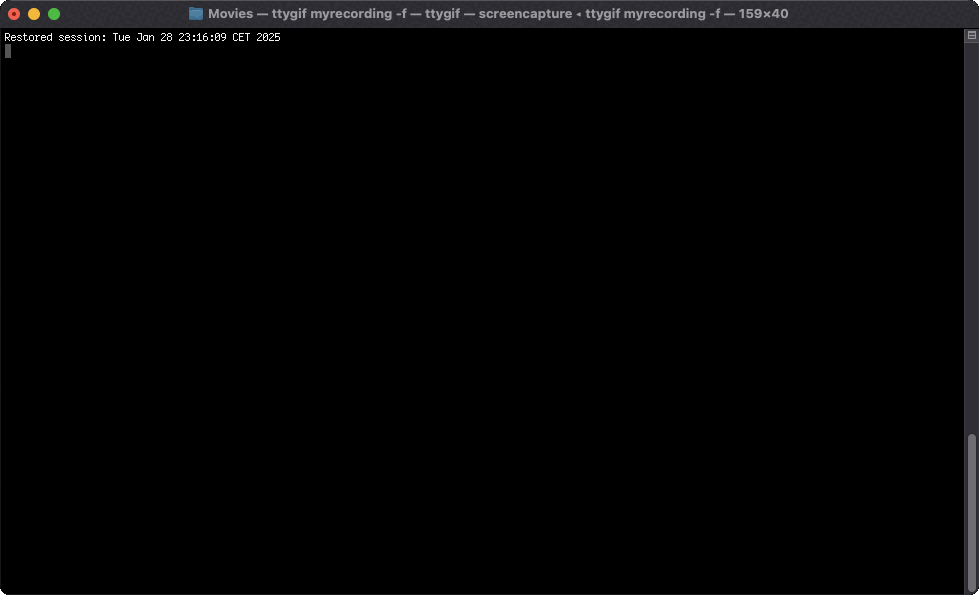

# 🚀 FilesFly

A blazingly fast S3 file uploader with a beautiful CLI interface, powered by Bun.

## 🎥 Demo

Watch FilesFly in action - blazing fast uploads with a beautiful progress bar:



## ✨ Features

- 🚄 **Lightning Fast**: Utilizes Bun's native S3 client for maximum performance
- 📊 **Real-time Progress**: Beautiful progress bar with upload speed and ETA
- 🔒 **Secure**: Safe credential management via config file
- 🎨 **Beautiful UI**: Colorful and intuitive command-line interface
- 🔄 **URL-Safe**: Automatic filename sanitization for web compatibility
- ⚡️ **Simple**: Just one command to upload or delete files
- 🛡️ **Type-Safe**: Written in TypeScript for reliability

## 🚀 Installation

### Quick Install (Recommended)
```bash
curl -fsSL https://raw.githubusercontent.com/ralf-boltshauser/filesfly/master/install.sh | bash
```

### Manual Installation
```bash
# Install from source
git clone https://github.com/ralf-boltshauser/filesfly.git
cd filesfly
bun install
bun link
```

## ⚙️ Configuration

Create a configuration file at `~/.config/filesfly/filesfly.json`:

```json
{
  "ENDPOINT": "your-endpoint",
  "ACCESS_KEY_ID": "your-access-key",
  "SECRET_ACCESS_KEY": "your-secret",
  "BUCKET": "your-bucket",
  "REGION": "your-region"
}
```

## 📖 Usage

FilesFly provides several commands to manage your S3 files:

```bash
# Test your S3 connection
ff check

# Upload files
ff upload image.jpg                # Upload with original filename
ff upload data.csv -o report.csv   # Upload with custom filename
ff image.jpg                       # Quick upload (shorthand)

# Delete files
ff delete image.jpg               # Delete a file from S3

# Get help
ff --help                         # Show all commands
ff upload --help                  # Show upload options
```

## 🛠️ Development

```bash
# Clone the repository
git clone https://github.com/ralf-boltshauser/filesfly.git
cd filesfly
bun install

# Run locally
bun run src/index.ts
```

## 📦 Project Structure

```
├── bin/           # CLI entry point
├── src/
│   ├── cli/       # CLI setup and handling
│   ├── config/    # Configuration management
│   ├── s3/        # S3 operations
│   └── utils/     # Utility functions
└── tests/         # Test files
```

## 🤝 Contributing

Contributions are welcome! Please feel free to submit a Pull Request. For major changes, please open an issue first to discuss what you would like to change.

1. Fork the Project
2. Create your Feature Branch (`git checkout -b feature/AmazingFeature`)
3. Commit your Changes (`git commit -m 'Add some AmazingFeature'`)
4. Push to the Branch (`git push origin feature/AmazingFeature`)
5. Open a Pull Request

## 📝 License

This project is licensed under the MIT License - see the [LICENSE](LICENSE) file for details.

## 🙏 Acknowledgments

- Built with [Bun](https://bun.sh)
- Progress bar by [cli-progress](https://github.com/npkgz/cli-progress)
- Colors by [ansi-colors](https://github.com/doowb/ansi-colors)

## 💡 Ideas

- [ ] Add a "download" command to download a file from S3
- [ ] Add a "list" command to list all files in a bucket, with simple filters and sorting
- [ ] Add a "search" command to search for files in a bucket

## ↗ Ways this could develop
- [ ] DB Backuper: You just plug and play your db credentials, s3 credentials and backup config like interval and it just pushed sql db backups.
- [ ] File Versioning: Instead of "final_edit_v3.mp4", v4, v5, v6 _final_final... you just use a simple cli to keep track of versions and roll backs etc. 
- [ ] Simple Backup: Just simple folders that can be specified to be backuped once a day or so. 